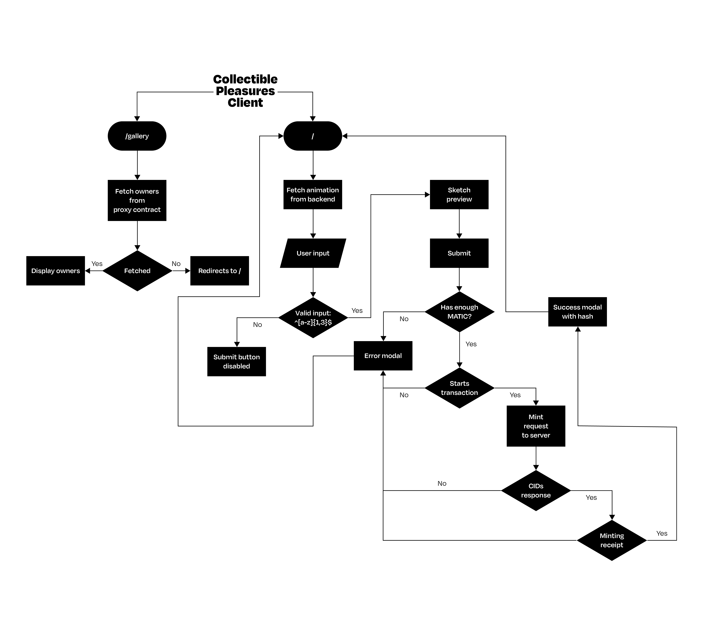
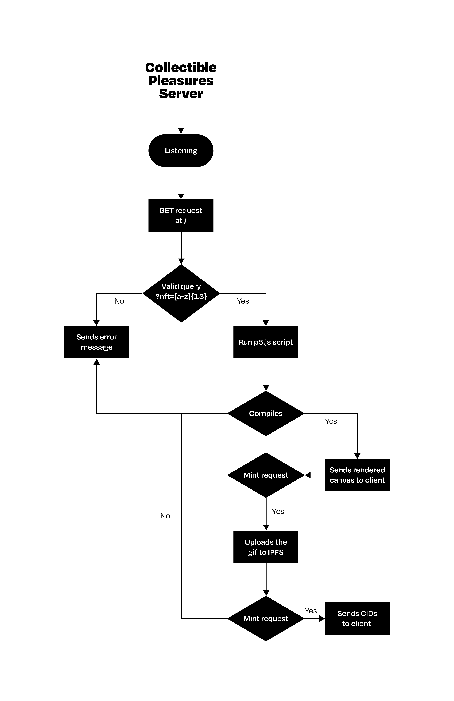

# Collectible Pleasures

The Collectible Pleasures DApp allows you to mint an NFT with 3 letters, Unknown Pleasures style, the client has a simple input field that takes the letters selected by the user (just uppercase) and uses the p5.js library behind the scenes to create the NFT.

## Project Details

-   Client logic

    <picture>
      <source media="(prefers-color-scheme: dark)" srcset="./_images/collectible-pleasures-client-dark.png">
      
    </picture>

-   Server logic

    <picture>
      <source media="(prefers-color-scheme: dark)" srcset="./_images/collectible-pleasures-server-dark.png">
      
    </picture>

-   Tech stack

    -   Web3: `solidity` `ethers.js` `hardhat` `openzeppelin` `polygon` `alchemy`
    -   Frontend: `Next.js` `Material UI` `React` `Typescript`
    -   Backend: `Typescript` `p5.js` `IPFS`

## Current Team Members

[**Lalo**](https://github.com/eduairet) - Frontend Developer, Web3 Enthusiast, Creative Coder, and Font Engineer.
